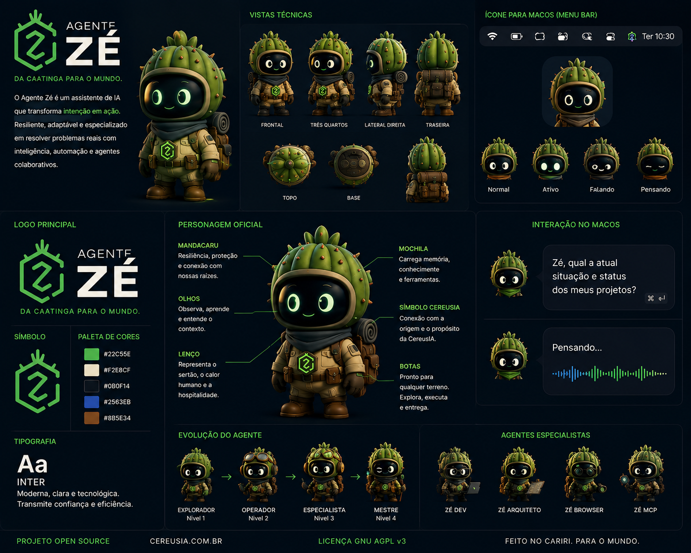

# Agente Zé

<p align="center">
  
</p>

<p align="center">
  <a href="https://github.com/cereusia/angenteze/actions/workflows/ci.yml"></a>
  <a href="LICENSE"></a>
  
</p>

Agente Zé é um projeto open source da CereusIA para construir um agente global de macOS baseado em Codex, MCP, automação local, memória persistente e agentes especialistas.

A missão é transformar intenção em ação com um operador local-first, auditável e seguro.

## Estado Atual

O projeto está na primeira base executável do MVP v0.1. O foco atual é estrutura compilável, contratos entre módulos e validação incremental.

Já existe:

- app macOS em SwiftUI via SwiftPM;
- menu bar app com hotkey global;
- janela de input principal;
- backend local em Python;
- memória SQLite inicial;
- registry MCP local;
- política local de permissões MCP;
- fluxo de confirmação MCP no app;
- comandos slash locais;
- testes Python e CI inicial.

Ainda não é um produto final para uso amplo. Voz, browser embutido, automação completa, empacotamento assinado e multiagente completo ficam fora do v0.1.

## Personagem

O Agente Zé também tem uma identidade visual inicial para orientar o futuro personagem do app: um operador de IA inspirado no mandacaru, na Caatinga e no conceito "Da Caatinga para o mundo".

<p align="center">
  
</p>

Os contratos e referências de personagem estão em `assets/character/agente-ze/` e `docs/character/`. Eles definem silhueta, paleta, estados emocionais, animações e integração futura com o app macOS.

## Arquitetura

```text
apps/macos/      App macOS SwiftUI e integração com o processo Python
agent-core/      Núcleo local em Python, runtime e comandos
memory/          Schema SQLite e política de memória local
mcp/             Registry e contratos MCP iniciais
specs/           Especificações versionadas do produto
docs/adr/        Registros de decisão técnica
scripts/         Scripts locais de build, teste e execução
tests/           Testes automatizados do agent-core
```

## Requisitos Locais

- macOS com Swift Package Manager disponível.
- Python 3.11+.
- Git.

Não há dependências externas obrigatórias para a base atual além da toolchain local.

## Execução Rápida

Clone o repositório e rode as validações principais:

```bash
git clone git@github.com:cereusia/angenteze.git
cd angenteze
./scripts/test-python.sh
./scripts/build-macos.sh
```

Execute o backend local:

```bash
./scripts/run-agent-core.sh run --prompt "status"
```

Execute o app macOS:

```bash
./script/build_and_run.sh
```

## Comandos Locais

O prompt do agente aceita comandos slash reimplementados no `agent-core`:

- `/help`
- `/status`
- `/doctor`
- `/git`
- `/memory`
- `/mcp`

## Documentação

- `AGENTS.md`: instruções principais para agentes.
- `.codex/PROJECT_RULES.md`: regras operacionais do projeto.
- `DIAGNOSTICO_INICIAL.md`: diagnóstico técnico inicial.
- `ROADMAP.md`: plano incremental.
- `CONTRIBUTING.md`: guia de contribuição.
- `assets/character/agente-ze/README.md`: guia dos assets do personagem.
- `docs/character/`: especificação visual e contratos do personagem.
- `docs/release/MVP_V0_1_CHECKLIST.md`: checklist da release alpha.
- `docs/security/MACOS_PERMISSIONS.md`: permissões macOS atuais e futuras.
- `specs/VISION.md`: visão do produto.
- `specs/ARCHITECTURE.md`: arquitetura e contratos.
- `specs/MCP.md`: diretrizes MCP.
- `specs/SECURITY.md`: segurança e privacidade.
- `specs/MILESTONE_V0_1.md`: checklist do MVP v0.1.

## Segurança

O Agente Zé deve permanecer local-first por padrão:

- não armazena segredos no repositório;
- trata permissões MCP como contrato explícito;
- exige confirmação para ações sensíveis;
- registra decisões técnicas relevantes como ADR;
- prioriza auditoria, reversibilidade e escopo mínimo.

## Contribuição

Contribuições são bem-vindas, mas o projeto ainda está em fase inicial. Antes de abrir mudanças grandes, leia `CONTRIBUTING.md`, `AGENTS.md` e os documentos em `specs/`.

## Licença

Distribuído sob a GNU Affero General Public License v3.0. Veja `LICENSE`.
